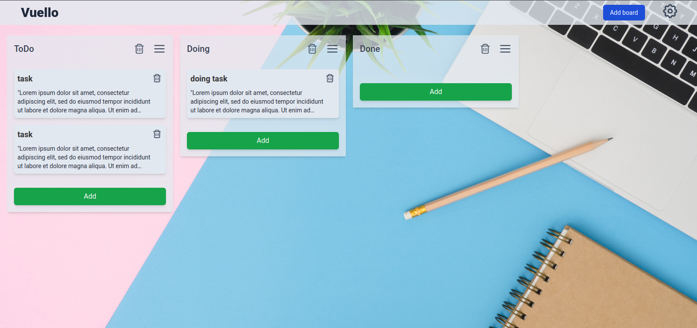

# VUELLO



Vuello -

#

## [Live demo](http://example.com/)

- email: user@mail.ru
- password: qwerty

#

## Technologies

- Vue 3
- Tailwind
- Pinia
- Firebase (Auth, Firestore)

#

# Usage

## Clone project

```
git clone https://github.com/aleksey-br/vue-trello

cd vue-trello
```

### Installing dependencies

```
npm install
```

### Start project

```
npm run serve
```

### Compiles and minifies for production

```
npm run build
```
